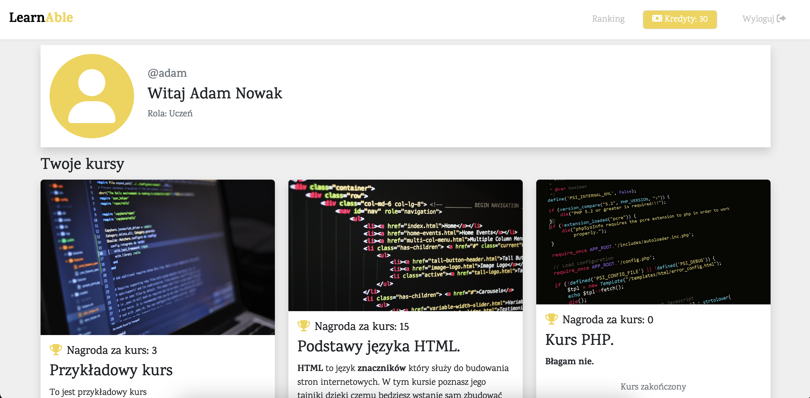
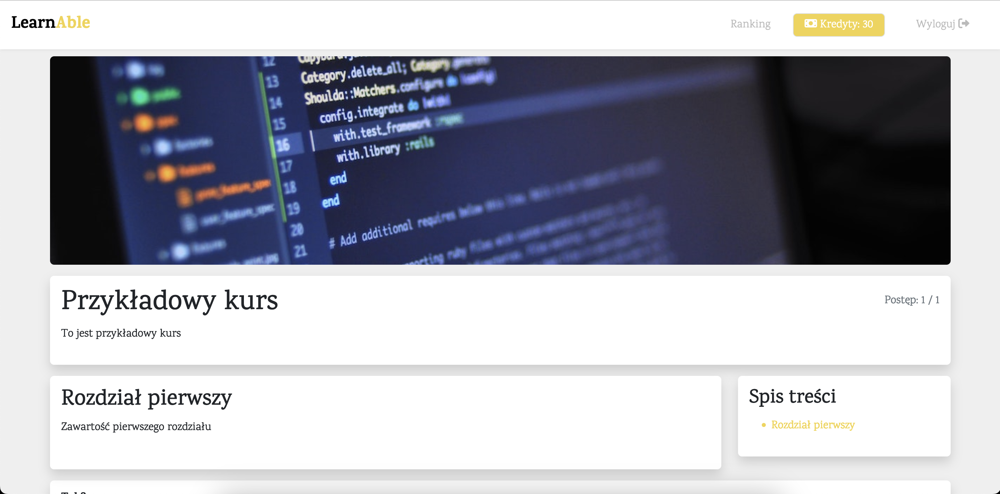
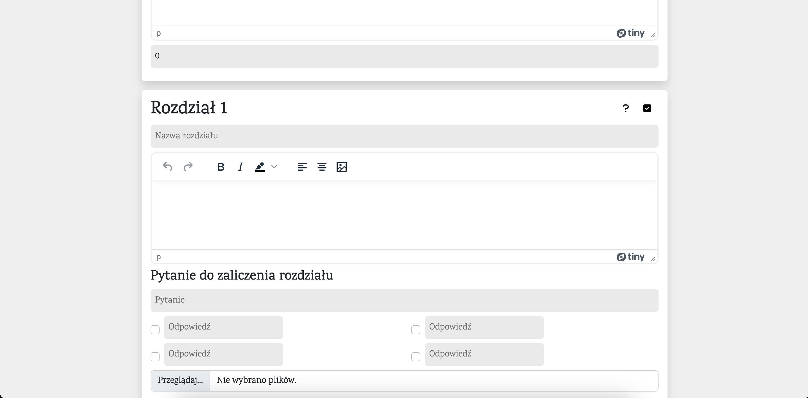

# Learnable project

Learn anywhere and however you want.


## Description

Learnable web app provides free courses for anyone and also allow you to become teacher, if you want to share your own knowledge.

User can be registered as teacher or student, teachers have privilege to create their own courses, in which students can participate and get completion certificates.


### Student view



### Taking course view



### Creating course view



### Setting up
```bash
npm i
npm start
```
